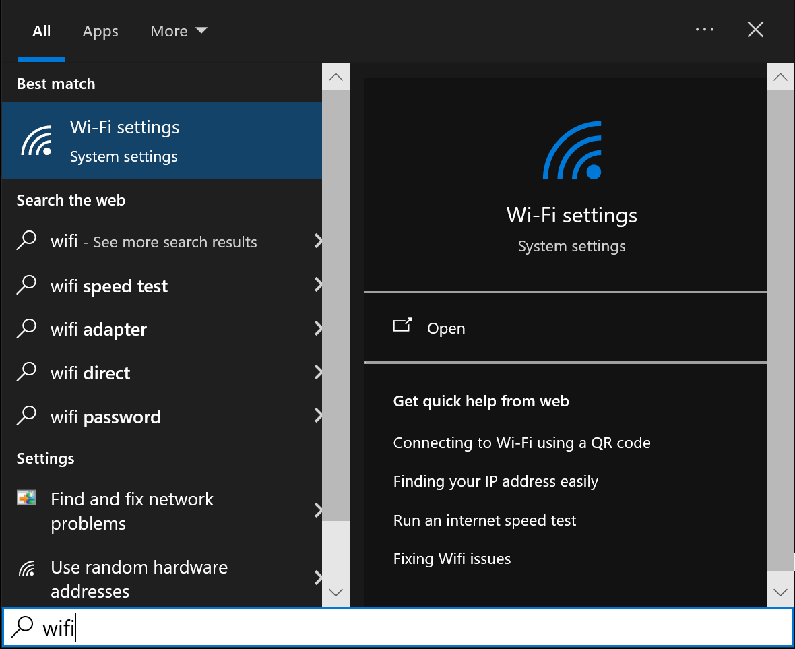
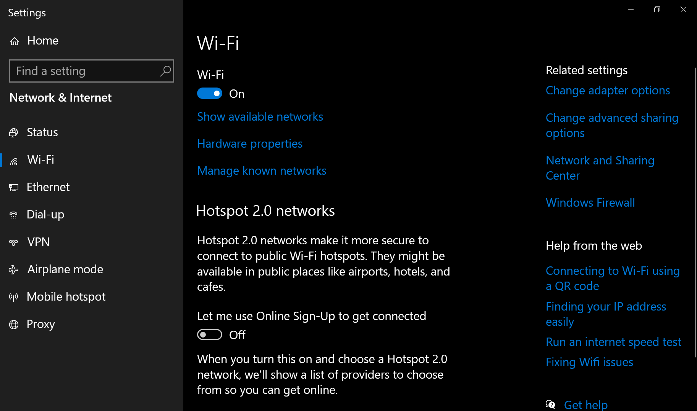
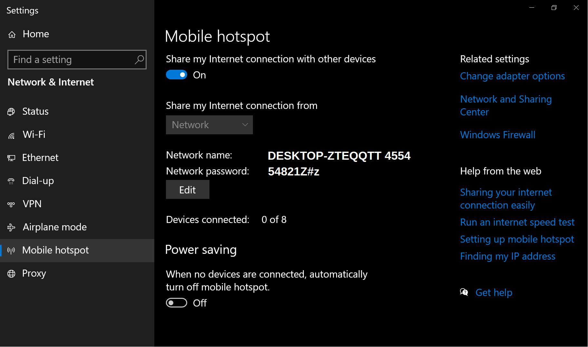
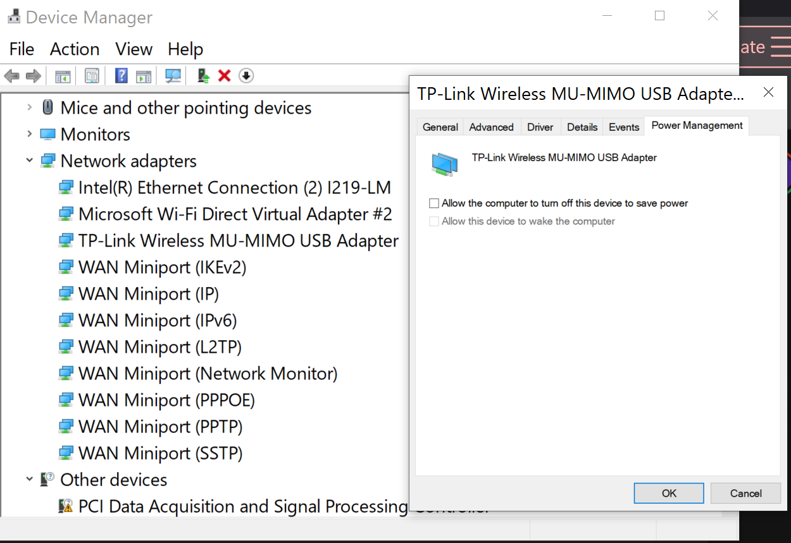
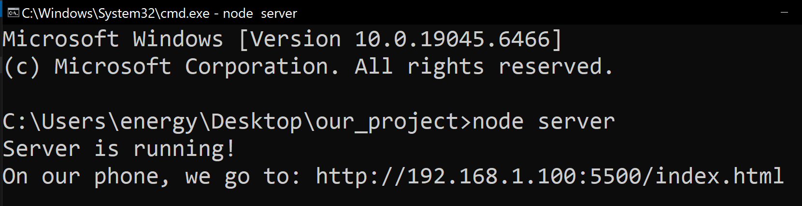

# CATopalian NodeJS Windows Mobile Hotspot
On Windows, using a USB Wi-Fi Antenna and with Wi-Fi turned On we create a mobile hotspot and we communicate with our mobile devices using our created network.

---

[HTML version](https://christopherandrewtopalian.github.io/CATopalian_NodeJS_Windows_Mobile_Hotspot/CATopalian_NodeJS_Windows_Hotspot.html)  

---

## Search for: **WiFi**


---

## Turn **Wi-Fi** On:


---

## Turn **Mobile Hotspot** On
Turn On our Mobile Hotspot  

It shows us the **Network Name** and **Network Password**



Make sure to turn **Power Saving** off, or else it will keep disabling the hotspot when it doesn't have a device connected.

---

## Keep **Wi-Fi Connection On**:  

Search Start menu for: **Device Manager**

In **Device Manager** > **Network Adapters** > **TP-Link (model you own)**  
We **RIGHT CLICK** on the **TP-Link** and choose **PROPERTIES**  

We **UNCHECK the Box** for  
**Allow the computer to turn off this device to save power**  

Press **OK**

This way our connection will always stay on instead.



---

## Turn **Cell Phone Wireless** On:
In our Cell phone Wireless Settings we make sure Wireless is turned on


---

## **Connect** our Cell phone to our Network
* In our Cell phone click on Settings > Wi-Fi
* **Connect to DESKTOP-ZTEQQTT 4554**
* Enter the password 54821Z#z:


Now our phone is connected to our computer network!

---

## Get Computer's Address
For our computer and mobile devices to communicate the moibile devices need our computer's address.
1. Open our Windows Command Prompt (type cmd into the start menu).

2. In Command Prompt we Type **ipconfig** and press **Enter**.

3. Scroll to find **Wireless LAN adapter Local Area Connection** (or it might say Mobile Hotspot).

4. Look for the **IPv4 Address**. It will look like: **192.168.1.100**

Write that down. This is the "front door" of our server.


---

## Make a New Folder and Name It **our_project**  
> We will put our **server.js** and **index.html** in **our_project** folder.

---

## Here is our node.js **server.js** script  
## [server.js](src/tutorials/001/server.js)  

```javascript
const http = require('http');
const fs = require('fs');

const server = http.createServer(function(req, res)
{
    // read the index.html file located in the same folder
    fs.readFile('index.html', function(err, data)
    {
        if (err)
        {
            res.writeHead(404);
            res.end("Error: index.html not found!");
            return;
        }

        // send the HTML file to the browser
        res.writeHead(200, { 'Content-Type': 'text/html' });
        res.end(data);
    });
});

// listen on port 5500 on all network interfaces (0.0.0.0)
server.listen(5500, '0.0.0.0', function()
{
    console.log("Server is running!");

    console.log("On your phone, go to: http://[192.168.1.100]:5500/index.html");
});
```
---

# Here is our **index.html** file  
## [index.html](src/tutorials/001/index.html)  

```html
<!DOCTYPE html>
<html>
<head>
<title>Tutorial Project</title>
<meta name="viewport" content="width=device-width, initial-scale=1.0">
<style>

body
{
    font-family: sans-serif;
    text-align: center;
    padding: 50px 20px;
    background-color: rgb(30, 30, 30);
    color: rgb(255, 255, 255);
}

h1
{
    color: rgb(70, 70, 70);
}

</style>

</head>

<body>

<h1> Connection Successful! </h1>

<p> Our mobile device is now talking to our Node.js server. </p>

</body>

</html>
```

---

## We **cmd** in the **Address Bar** of **our_project** folder


### In our folder that has our **server.js** and **index.html** files we put our mouse arrow in the **address bar** and we type **cmd** and press **Enter**.

### This opens the Command prompt with our folder as the directory chosen.

---

## In the Command Prompt we opened, We now type

## **node server.js**  
## press Enter

This starts our server on port 5500




---

## On our Cell Phone Browser we Type the Address: 192.168.1.100:5500/index.html


---

### How to Download this App
1. Click the green Code Button on this github page
2. Choose Download ZIP
3. Save the Zip File
4. Extract All
5. Double click the README.md file in VSCode and choose Preview

---

Happy Scripting :-)

---

//----//

// Dedicated to God the Father  
// All Rights Reserved Christopher Andrew Topalian Copyright 2000-2026  
// https://github.com/ChristopherTopalian  
// https://github.com/ChristopherAndrewTopalian  
// https://sites.google.com/view/CollegeOfScripting

